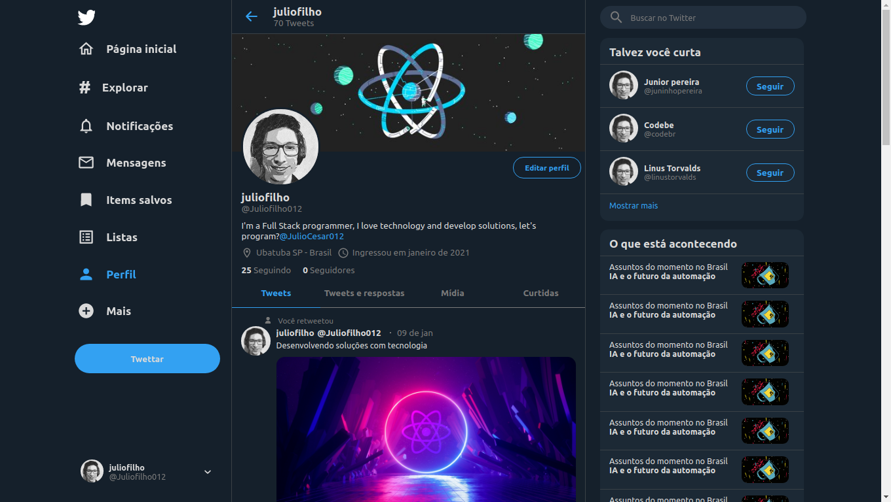
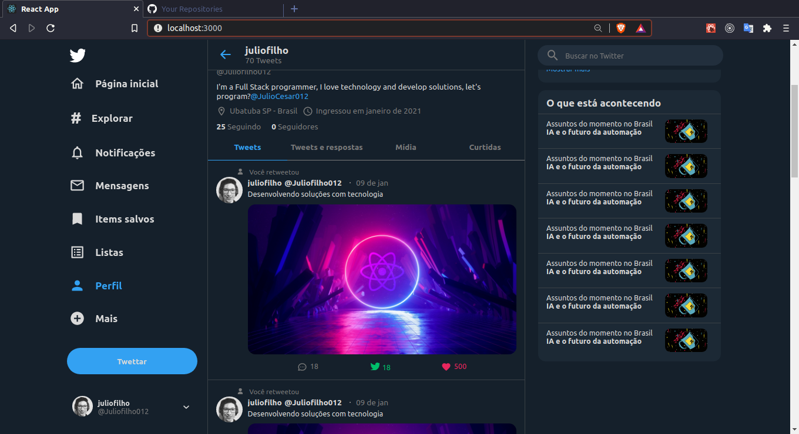

<h1 align="center">
    
</h1>

<h4 align="center">
	:heavy_check_mark:  Clone Twitter projeto Fullstack 🚀 Concluído! :heavy_check_mark:
</h4>
<p align="center">
  
</p>

<p align="center">
  <a href="#information_source-sobre-o-projeto">Sobre o projeto</a>&nbsp;&nbsp;&nbsp;|&nbsp;&nbsp;&nbsp;
  <a href="#computer-objetivo">Objetivo</a>&nbsp;&nbsp;&nbsp;|&nbsp;&nbsp;&nbsp;
  <a href="#rocket-tecnologias">Tecnologias</a>&nbsp;&nbsp;&nbsp;|&nbsp;&nbsp;&nbsp;
  <a href="#information_source-como-usar">Como usar</a>&nbsp;&nbsp;&nbsp;|&nbsp;&nbsp;&nbsp;
  <a href="#rocket-testar-online">Testar online</a>&nbsp;&nbsp;&nbsp;|&nbsp;&nbsp;&nbsp;
</p>

## :information_source: Sobre o Projeto

PROJETO desenvolvido para aprendizado de criação de interfaces profissionais com React.js. Nesse repositório você vai encontrar o clone do twitter atualizado na data de 09 de Janeiro de 2021. Desenvolvi com React.js e algumas bibliotecas. Esse projeto tem como foco a responsividade e efeitos de hover ao passar e clicar sobre os botões da interface. Foi utilizado o conceito de flexbox para o desenvolvimento, aproveite e sinta-se a vontate para modificar a seu gosto! Tive que adaptar alguns icones, e componentes por isso talvez seria bom uma melhora na feature desse items. Poderiamos melhorar diversas outras coisas no projeto por isso deixo livre para implementarem. Poderíamos melhorar a coloração e tamanho dos componentes.

## :computer: Objetivo

Criar a interface do perfil do Twitter o mais semelhante possivel.

<h1 align="center">
    
</h1>

## :rocket: Tecnologias

O projeto foi desenvolvido com as seguintes tecnologias e depêndencias:

## :computer: Frontend:

- [Typescript][typescript]
- [React.js][reactjs]
- [React Sticky Box][react-sticky-box]
- [Styled Components][styled-components]
- [Styled Icons][styled-icons]
- [Yarn][yarn]

## :information_source: Requisitos para rodar

- [Yarn][yarn] ou [Node.js: versão utilizada v14.15.0][nodejs]

## :information_source: Como usar

Clone a aplicação com o git clone, siga os passos abaixo.

### Instale o Front-end

```bash

Em seu terminal na linha de comando:

# Clone o repositório
$ git clone https://github.com/JulioCesar012/Clone_Twitter.git

# Vá para a pasta frontend
$ cd Clone_Twitter

# Instale as dependências
$ yarn install
      ou
$ npm install

# Inicie
$ yarn start

```

## :rocket: Testar Online

O projeto foi hospedado em servidor heroku para você testar a vontate, clique no link abaixo e confira como ficou.

- [Aplicação web][frontend]

Desenvolvido com ♥ por @JulioCesar012 :wave: [Me contate!](https://www.linkedin.com/in/julio-cesar-filho-759653171/)

[typescript]: https://www.typescriptlang.org/
[reactjs]: https://reactjs.org
[react-sticky-box]: https://www.npmjs.com/package/react-sticky-box
[styled-components]: https://styled-components.com/
[styled-icons]: https://styled-icons.js.org/
[yarn]: https://yarnpkg.com/

[frontend]: https://clonetwitter21.netlify.app/
